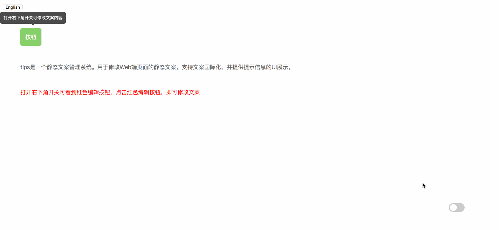
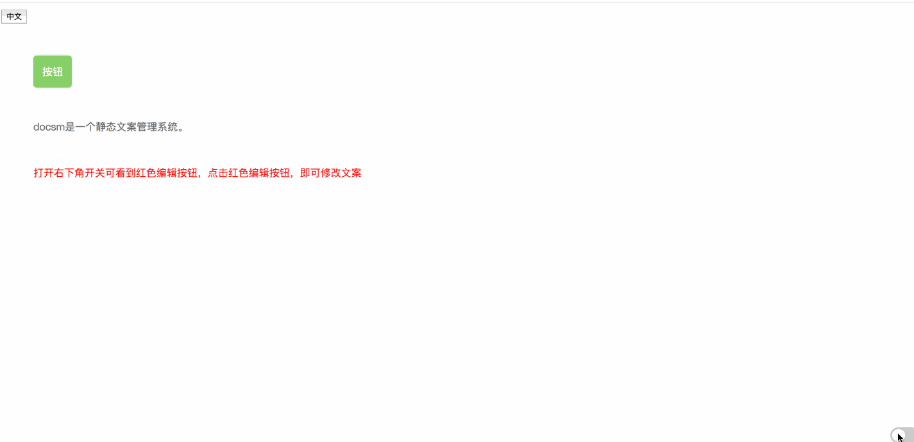
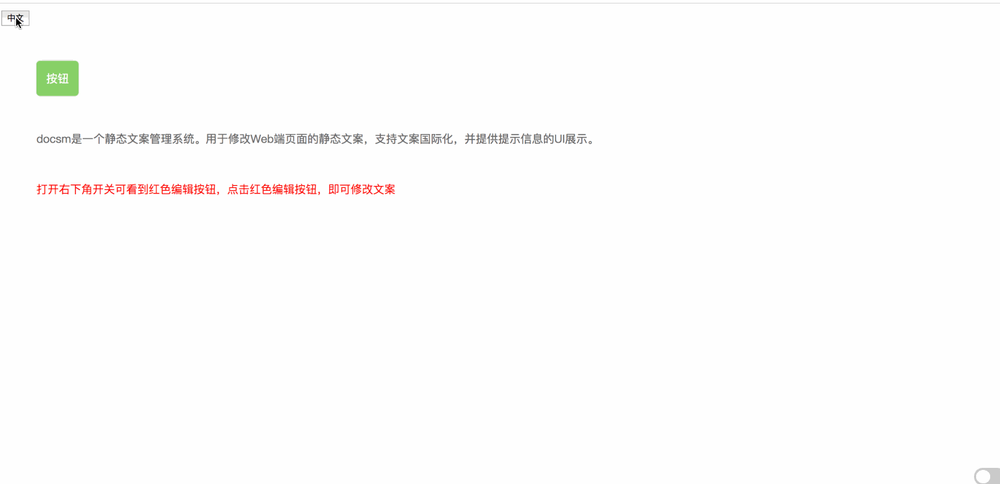
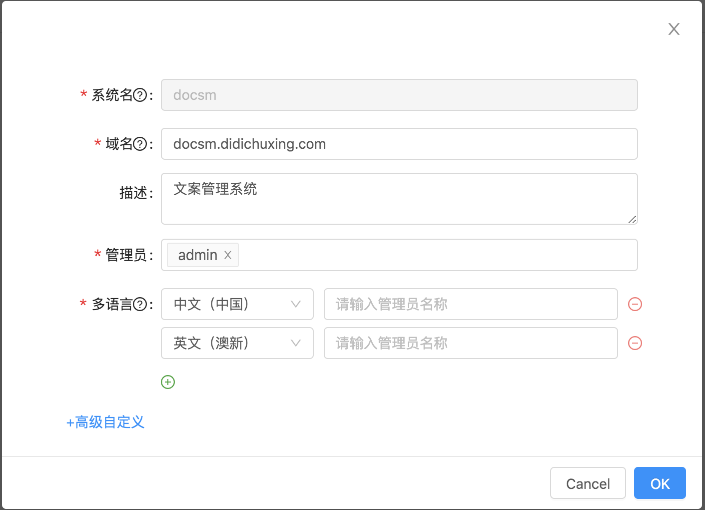

# DocsM - DOCumentS Management platform

## What is DocsM?
DocsM is a static documents management platform. Used to modify static documents of Web pages, support documents internationalization, and provide UI display of prompt information. Its purpose is to solve the problem of frequent static documents modification by front-end developers, and avoid the complicated online process caused by simple documents modification.

## What can DocsM do?
Here is a simple demonstration of how you can modify the documents information on the page when you accessed the management platform.
### Text modification and UI Display of tips

The authorized user can see that there is a switch button in the lower right corner of the page. The red button of editing appears on the open button page. The prompt copy information can be modified by clicking on the button, and the modified content can be seen on the refreshed page after submitting and saving. At the same time, the container UI display of prompting information is also provided by the platform.

### Text modification of page content

The way to modify the content copy of the page is the same as that of the prompt information, but the difference is that there is an additional publishing operation, because the content of the page is more stringent than the requirement of the prompt, and the modification will directly affect the user's direct perception. So here we make a distinction between online and offline environments. You can only see online and offline environments before publishing. Please click [here](./doc/onlineAndOffline.md).

### Documents internationalization

In demo demonstration, Chinese and English versions of the language are provided. Click the button to see the switching of different language content.

## How to looking for demo?
- Install `node` environment, version V8 and above
- Install database `MongoDB`, version V4
- Create database named `docsm`
- Startup：`sh start.sh`
- Open in the browser: `localhost:8090` ---> Click on the new project ---> Create project,systemName：docsm,Multilingual：Chinese and English,save ---> Click on demo in the navigation bar and jump to the demo page for documents modification

## How to deploy and use?
### Deploy
#### docsm-web
- Introduction: This module is a simple Web layer, which provides the interface of adding, deleting and checking copy data, that is, all UI operation interfaces call here. It is mentioned above that only authorized users can edit the copyright directly, so users'information is needed where the platform involves authorization control. Because each company has its own mechanism for user information management, users need to implement it independently. Once the implementation is completed, the service can be deployed.
- Deploy
	- Step 1: Modify the MongoDB data address in `docsm-web/src/config/index.js`, and the port of the real service;
	- Step 2: Deploy web server；
	- Step 3: Startup: `npm run start`;
#### docsm-ui
- Introduction: This module is the management front-end module, where the access platform's copyright information is managed. Similarly, we need to call the interface of the Web module about user information operation, which needs to be implemented separately by ourselves;
- Deploy
	- Step 1: Build，`npm run build`;
	- Step 2: Deploy packaged static files to nginx or other static file server;

#### docsm-sdk
- Introduction: This module is a JS SDK managed by webpack. The operation of modifying copyright seen in the picture above is implemented in this module. The packaged files are finally referenced in the access platform in the form of CDN service;
- Deploy
	- Step 1: Modify the server address in `docsm-sdk/src/config/index.js` to the address of `docsm-web` service;
	- Step 2: We use webpack to manage SDK and write the packaged path in `webpack.config.js`. You can pack it into your own directory by modifying the path inside;
	- Step 3: Deploy packaged SDK to CDN service;

### Use
When the above deployment process is completed and the services can be accessed properly, we can access the services that need copyright management.

#### Step 1: Creating Access System
Create service information to access the platform in the document management platform, as shown in the following figure:

Form field explanation:
- systemName：Unique Identification of System;
- Domain name: Online domain name of the system;
- Administrator: Members who can modify the system documents;
- Multilingualism: Create the language version that the system needs to support, each language can set up different administrators;

#### Step 2：Quote SDK
The SDK file is introduced into the access system, and the system name filled in when the system is created is set in <head> (there is document modification, in order to avoid page blank, if the system does not use document modification function, it can not be placed in <head>). The code is as follows:
```
<script type="text/javascript" data-service="xxx" src="/docsm.js"></script>
```
Parametric interpretation:
- `data-service`：Here, the unique identification of the system filled in at the time of the first step of creation is passed in;
- `src`：This address is the deployment address of `docsm-sdk` packaged static files;

#### Step 3: Call SDK
Initialization function is called in the front-end code of access system, and the user name and language type of current system login are passed in. The code is as follows:
```
try {
  if (window.DocsM && Object.prototype.toString.call(window.DocsM.init) === '[object Function]') {
    window.DocsM.init(username, language);
  } else {
    document.addEventListener("DocsMSDKReady", function() {
      window.DocsM.init(username, language);
    }, false);
  }
} catch(e) {
  console.log(e);
}
```
Identification of optional languages:

| Language | key |
| :------| :------ |
| Chinese (china) |	zh_CN |
| English (Australia and New Zealand) |	en_US |
| Japanese |	ja_JP |
| Spanish (Mexico) |	es_MX |
| Portuguese (Brazil) |	pt_BR |

#### Step 4: Burying Points
Buried points are embedded in the front-end code of the access system. The front-end pages are routed as dimensions, and the ID of buried points under each route can not be repeated.
```
<span data-tip-id="demo-1" class="btn">Button</span>
<span data-tip-id="demo-2">DocsM is a static documents management system</span>
```

#### Step 5：Change Language
The call changing language code is as follows:
```
try {
  window.DocsM.changeLanguage(language);
} catch(e) {
  console.log(e);
}
```
You can see how the code is used in [demo](./demo/static/index.html), and see [here](./doc/otherFunc.md) for some additional functions.

## Contributing
Any contribution is welcome. All issues and pull requests are highly appreciated! For more details, please refer to the [contribution guide](./CONTRIBUTING.md).

## License
The DocsM platform is licensed under the terms of the Apache license. See [LICENSE](./LICENSE) for more information.

